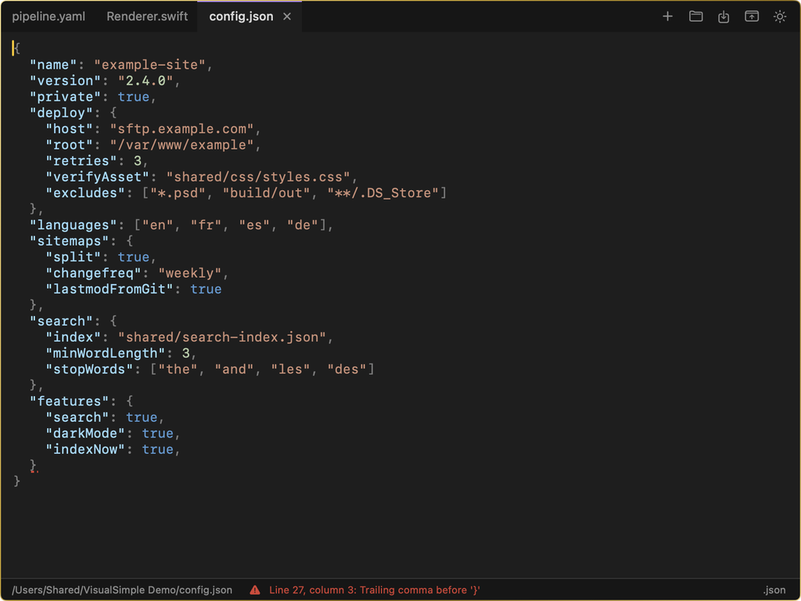
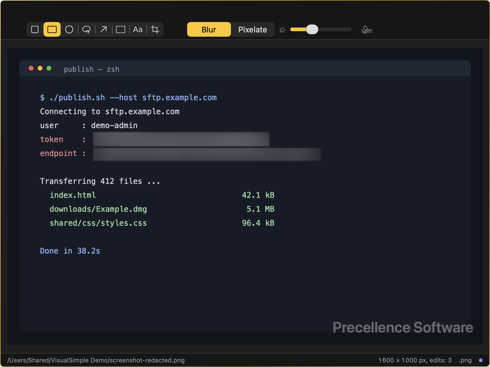

# VisualSimple

A local-only editor for macOS: text, code, images and PDFs in one tabbed window.

VisualSimple contains no networking code. Nothing is sent anywhere.

## Features

- Tabs, one document per tab, each with its own undo history
- Syntax colouring for 26 languages and formats: JSON, YAML, TOML, HTML, XML, Markdown, Swift, CSS, JavaScript, TypeScript, Python, Ruby, Perl, PHP, Shell, PowerShell, SQL, Rust, Go, C, Java, Kotlin, INI, Dockerfile, Makefile, .strings
- Structure checks with the faulty spot underlined. JSON and XML checks are strict; YAML, TOML, HTML, Markdown, .env and .ini checks are partial: they report "looks correct", never "valid"
- Images and PDFs: blur or pixellate areas, arrows, frames, text, crop, watermark, export to PNG, JPEG or HEIC
- Markdown and SVG preview, hexadecimal view for binary files
- Minimise to the menu bar
- English, French, Spanish and German

## Download

A signed and notarised build is available at https://precellence.icu

## Build

Open `VisualSimple/VisualSimple.xcodeproj` in Xcode and set your own development team. Deployment target: macOS 26.5. No third-party dependency.

`Examples/` holds one test file per checker, each with a single known fault.

## License

MIT, see `LICENSE`. The VisualSimple name and icon are not covered by the licence.

Copyright (c) 2026 Precellence Software.
